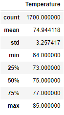
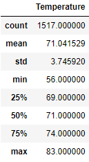
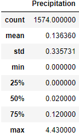
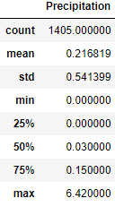

# Surfs Up Weather Analysis

## Overview

Weather for Oahu, Hawaii was analyzed to determine if the location is suitable for a business that specializes in surfing and ice cream; a location that deals in both needs to be situated in a place where the climate is warm year-round. Weather data was supplied in a SQLite database and the database queried by Python using the SQLAlchemy package. Pandas is used to view subsets of the data in periods of interest and gain summary statistics to understand the weather trends during those periods.

## Results

The two periods of interest where the months of June and December as the months fall opposite to each other on the calendar and depending on location usually vary drastically in terms of high and low temperatures.
| June Temperature Summary Statistics | December Temperature Summary Statistics |
| :---: | :---: |
|  |  |

* June's temperatures vary over a 21°F range from 85°F to 64°F; on average most recorded temperatures for the month on the island of Oahu were 75°F, which is also the median value for the location.
* December varies over a slightly larger range of 27°F from 83°F to 56°F, with the mean and median values also falling on the same value of 71°F. 
* While December is slightly cooler than June, the difference comparing values such as the mean or minimum temperatures is overall quite small, with the most drastic change being only 8°F between the minimums for each month. Overall the majority of the data lies within the 70s for both months.

## Summary

The location of Oahu is a great location for the proposed business going by the weather: two months on the polar opposite ends of the calendar have steady warm temperatures, with an average of 75°F in a typically warm month in the northern hemisphere like June and 71°F in a usually colder month like December. The data gathered for these locations are appears to have a normal distribution with over 1500 samples for each month, where the majority of the data is above 70°F for both months. This consistency helps ensure there is no period during the year that the weather will contribute to slower sales.

Of course, temperature is one aspect of the weather than can influence people's desire to participate in outdoor activities, so analyzing the amount of rainfall in the location is also important.

| June Precipitation Summary Statistics | December Precipitation Summary Statistics |
| :---: | :---: |
|  |  |

Here the data does not have a normal distribution, with the means for each month being greater than the median, owing to max values that are very significantly larger than those found at the 3rd quartile in each month: June had a max of 4.43 inches of rainfall compared to 0.12 inches at the 75 percentile, and December 6.42 inches at max compared to 0.15. This heavy right-skew makes the median a better way to generalize the data, as the vast majority of observations are values that don't even surpass 0.15 inches of rainfall in either month. These values, 0.02 inches in June and 0.03 inches in December, are very low inidicating that most days rain is not a huge concern, with rare instances of extreme rainfall.